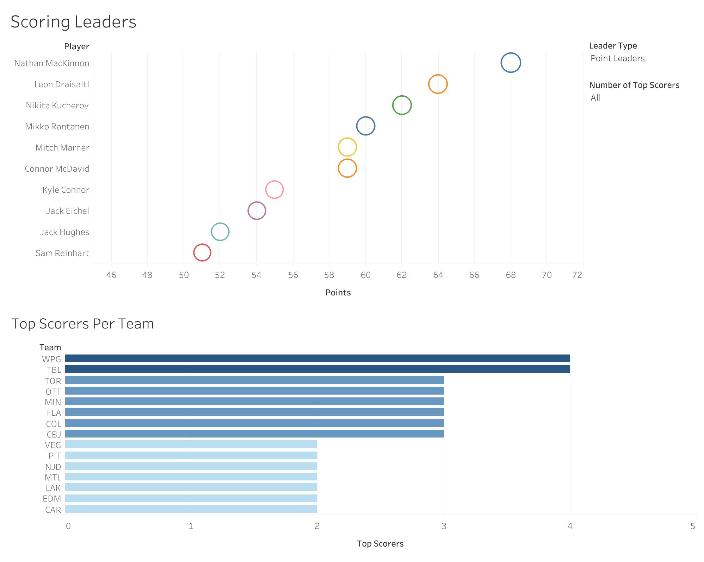
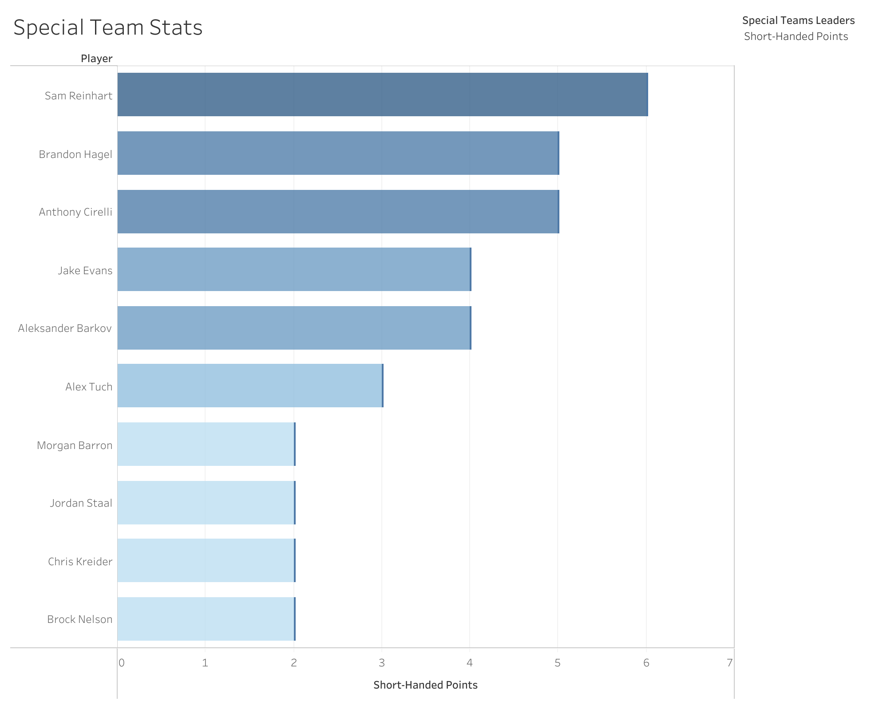
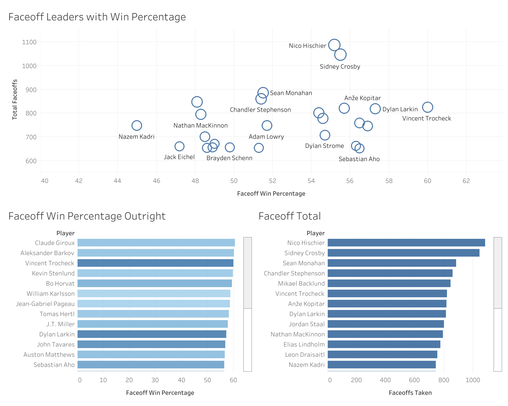
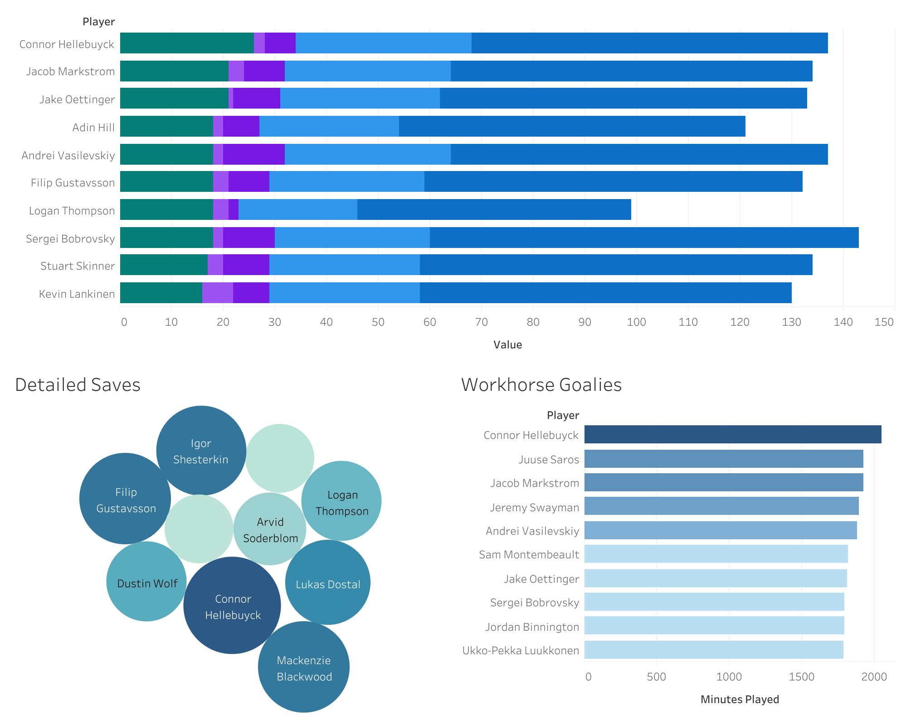

# NHL Stats Analytics — 2024-25 (Mid-Season Project)

This project analyzes NHL player and goalie performance data up to January 13, 2025.  
The goal was to build a full analytics pipeline, from raw data extraction to SQL transformations and Tableau dashboards, as a hands-on portfolio project to strengthen my real-world data analytics skills.

---

## Project Summary

- Collected partial-season NHL data for analysis.
- Cleaned data, updated team information for traded players, and converted time fields using SQL.
- Analyzed scoring leaders, faceoffs, goalie workloads, and special teams efficiency.
- Designed multiple Tableau dashboards to present the final insights.

---

## Tech Stack

| Stage | Tools Used |
|-------|-------------|
| Data Source | Hockey-Reference |
| Data Storage | CSV |
| Data Cleaning | SQL (MySQL) |
| Analysis Queries | SQL |
| Visualization | Tableau Public |

---

## Data Sources

- Raw CSV files downloaded from [hockey-reference.com](https://www.hockey-reference.com/), including:
  - `goalie_stats.csv`
  - `standard_stats.csv`
  - `team_stats.csv`
- Data snapshot taken on **January 13, 2025** for mid-season analysis.
- CSV files located in `/data/raw/` with cleaned outputs in `/data/processed/`.

---

## Data Cleaning Steps

- Converted time-on-ice (`TOI`, `ATOI`) columns from `MM:SS` to float format.
- Handled players with `2TM` entries by assigning a consistent team and removing duplicates.
- Cleaned goalie data similarly, including TOI normalization and team adjustments.
- Final cleaned tables (`standard_stats_added`, `goalie_stats_new`) used for all analysis.

---

## Analysis Focus Areas

-  **Scoring Leaders**: Top goal scorers, assist leaders, point leaders, and scoring depth by team.
-  **Faceoff Analysis**: Total faceoffs, win %, average faceoffs per game.
-  **Special Teams**: Powerplay and shorthanded leaders.
-  **Goalie Performance**: Saves per game, wins, time-on-ice workload leaders.

---

## Key Insights

- Claude Giroux led faceoff win % (~60%), among players with >500 faceoffs.
- Juuse Saros and Connor Hellebuyck faced over 34 shots per game on average.
- Nathan MacKinnon led in points and assists as of mid-January 2025.
- Brayden Point led all players in powerplay points.
- Shorthanded scoring was more evenly distributed, with several players tied near the top.

---

## Tableau Dashboards

Interactive dashboards built using Tableau Public:

- [NHL Scoring Leaders](https://public.tableau.com/app/profile/cole.mcnabb/viz/NHLScoringLeadersPriorto011225/ScoringLeaders)
- [NHL Special Team Leaders](https://public.tableau.com/app/profile/cole.mcnabb/viz/NHLSpecialTeamLeadersPriorto011225/SpecialTeamStats)
- [NHL Faceoff Leaders](https://public.tableau.com/app/profile/cole.mcnabb/viz/NHLFaceoffLeadersPriorto011225/FaceoffLeaders)
- [NHL Goalie Stats](https://public.tableau.com/app/profile/cole.mcnabb/viz/NHLGoalieStats_17432274620950/GoalieStats)

---

## Dashboard Previews

### Scoring Leaders

### Special Team Leaders

### Faceoff Leaders

### Goalie Stats

---

## Repository Structure

- `data/raw/`        → Original raw CSV files
- `data/processed/`  → Cleaned & aggregated datasets
- `sql/`             → SQL data cleaning & analysis queries
- `img/`             → Dashboard preview screenshots
- `README.md`        → Project overview (this file)

